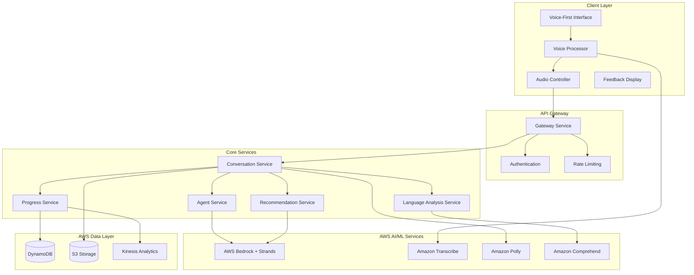

# LanguagePeer Design Document

## Overview

LanguagePeer is architected as a modular, voice-first application that combines real-time speech processing with intelligent AI agents to create natural language learning conversations. The system uses a microservices approach with distinct components for voice processing, AI agent management, conversation orchestration, and progress tracking.

The application prioritizes low-latency voice interactions while maintaining sophisticated language analysis capabilities. The modular AI agent system allows for diverse conversation partners with distinct personalities and teaching styles, creating a safe and judgment-free environment for language practice.

**Key Design Principles:**
- **Voice-First Experience**: All interactions prioritize voice input/output with minimal UI distractions
- **Supportive Learning Environment**: Non-judgmental feedback focused on encouragement and improvement
- **Personalized Adaptation**: AI agents adapt to individual learning styles and progress
- **Real-time Responsiveness**: Sub-3-second feedback delivery for natural conversation flow
- **Modular Agent Architecture**: Multiple specialized agents for different learning scenarios

## Architecture

### AWS GenAI Hackathon Compliance

LanguagePeer meets all three mandatory hackathon requirements:

#### 1. Large Language Model (LLM) hosted on AWS Bedrock
- **Primary LLM**: AWS Bedrock foundation models (Claude 3.5 Sonnet, Llama 3.1, Nova Pro)
- **Model Selection**: Dynamic routing between models based on conversation context and user needs
- **Custom Fine-tuning**: Language-specific prompt engineering for optimal learning outcomes

#### 2. Required AWS Services Integration
- **Amazon Bedrock Agents**: Core agent orchestration and reasoning engine
- **Strands Agents SDK**: Modular agent personalities with autonomous decision-making
- **Amazon Bedrock**: Foundation model hosting and inference
- **Amazon Transcribe**: Real-time speech-to-text processing with confidence scoring
- **Amazon Polly**: Natural speech synthesis for agent responses with SSML support
- **Amazon Comprehend**: Language analysis, entity detection, and grammar assessment
- **AWS Lambda**: Serverless compute for agent logic and voice processing
- **Amazon DynamoDB**: Conversation state, user progress, and session storage
- **Amazon S3**: Audio file storage and retrieval
- **Amazon Kinesis**: Real-time analytics and event streaming for progress tracking

#### 3. AWS-Defined AI Agent Qualification
- **Reasoning LLMs**: Bedrock models make autonomous decisions about conversation flow, difficulty adjustment, feedback timing, and topic selection
- **Autonomous Capabilities**: Agents independently provide encouragement, detect user frustration, adjust teaching methods, and recommend personalized sessions
- **External Integrations**: 
  - Voice processing APIs (Transcribe/Polly)
  - Language analysis tools (Comprehend)
  - Real-time databases (DynamoDB)
  - Analytics systems (Kinesis)
  - Multi-agent coordination through Strands framework

### High-Level Architecture



### Technology Stack

- **Frontend**: React with TypeScript for voice-first web interface
- **Backend**: AWS Lambda with API Gateway for serverless architecture
- **Voice Processing**: Amazon Transcribe (STT) and Amazon Polly (TTS) with real-time streaming
- **AI/ML**: AWS Bedrock with Strands Agents for modular AI conversations
- **Database**: Amazon DynamoDB for user profiles, sessions, and progress tracking
- **Real-time Communication**: WebSocket connections for voice streaming
- **Storage**: Amazon S3 for audio file storage and processing
- **Analytics**: Amazon Kinesis for real-time progress tracking and personalization
- **Deployment**: AWS CDK for infrastructure as code

## Components and Interfaces

### Voice Processing Component

**Responsibilities:**
- Real-time speech-to-text using Amazon Transcribe Streaming
- Audio quality assessment and user guidance
- Voice synthesis using Amazon Polly with personality-matched voices
- Seamless voice interaction with minimal latency

**Key Interfaces:**
```typescript
interface VoiceProcessor {
  startTranscribeStream(): Promise<TranscribeStreamingClient>
  stopTranscription(): Promise<TranscriptionResult>
  synthesizeWithPolly(text: string, voice: PollyVoiceId, ssml?: string): Promise<AudioStream>
  assessAudioQuality(audioStream: AudioStream): Promise<QualityMetrics>
  handleVoiceErrors(): Promise<AlternativeInteractionMethod>
}

interface QualityMetrics {
  clarity: number
  confidence: number
  backgroundNoise: number
  recommendations: string[]
}
```

### Strands Agent Service

**Responsibilities:**
- Orchestrate multiple AI agents with distinct personalities
- Provide supportive, non-judgmental conversation experiences
- Adapt conversation style based on user preferences and progress
- Coordinate agent handoffs for specialized scenarios

**Key Interfaces:**
```typescript
interface StrandsAgent {
  id: string
  personality: AgentPersonality
  generateSupportiveResponse(context: ConversationContext): Promise<AgentResponse>
  adaptToUserEmotionalState(userState: EmotionalState): void
  provideEncouragement(userProgress: ProgressMetrics): Promise<MotivationalMessage>
  detectUserFrustration(conversationHistory: Message[]): Promise<FrustrationLevel>
}

interface AgentPersonality {
  name: string
  traits: string[]
  conversationStyle: 'friendly-tutor' | 'strict-teacher' | 'conversation-partner' | 'pronunciation-coach'
  supportiveApproach: SupportiveStrategy
  voiceCharacteristics: PollyVoiceConfig
}

interface SupportiveStrategy {
  errorHandling: 'gentle-correction' | 'positive-reinforcement' | 'patient-repetition'
  encouragementFrequency: 'high' | 'medium' | 'low'
  difficultyAdjustment: 'automatic' | 'user-guided'
}
```

### Language Analysis Service

**Responsibilities:**
- Real-time grammar analysis using Amazon Comprehend and Bedrock reasoning
- Fluency assessment combining Transcribe confidence with AI analysis
- Vocabulary evaluation and contextual suggestions
- Constructive feedback generation within 3-second requirement

**Key Interfaces:**
```typescript
interface LanguageAnalyzer {
  analyzeGrammar(text: string, context: ConversationContext): Promise<GrammarAnalysis>
  assessFluency(audioData: AudioStream, transcription: string): Promise<FluencyMetrics>
  evaluateVocabulary(text: string, userLevel: LanguageLevel): Promise<VocabularyFeedback>
  generateConstructiveFeedback(analysis: LanguageAnalysis): Promise<SupportiveFeedback>
}

interface SupportiveFeedback {
  improvements: string[]
  alternatives: string[]
  encouragement: string
  nextSteps: string[]
  deliveryTiming: number // milliseconds
}
```

### Progress Tracking Service

**Responsibilities:**
- Record and analyze user performance metrics over time
- Generate visual progress indicators and milestone tracking
- Identify strengths and improvement areas
- Provide personalized session recommendations

**Key Interfaces:**
```typescript
interface ProgressTracker {
  recordSession(sessionData: SessionMetrics): Promise<void>
  calculateProgress(userId: string, timeframe: TimeRange): Promise<ProgressReport>
  identifyStrengthsAndWeaknesses(userHistory: SessionHistory[]): Promise<LearningInsights>
  generateRecommendations(userProfile: UserProfile): Promise<SessionRecommendations>
  trackMilestones(userId: string): Promise<MilestoneProgress>
}

interface ProgressReport {
  overallImprovement: number
  grammarProgress: number
  fluencyProgress: number
  vocabularyGrowth: number
  confidenceLevel: number
  visualIndicators: ProgressVisualization[]
}
```

### Recommendation Engine

**Responsibilities:**
- Suggest topics and difficulty levels based on user history
- Recommend appropriate AI agents for different learning goals
- Provide variety in conversation scenarios and contexts
- Adapt recommendations based on user feedback and progress

**Key Interfaces:**
```typescript
interface RecommendationEngine {
  recommendTopics(userProfile: UserProfile, sessionHistory: SessionHistory[]): Promise<TopicRecommendations>
  suggestAgents(learningGoals: LearningGoal[], currentProgress: ProgressMetrics): Promise<AgentRecommendations>
  diversifyPractice(recentSessions: SessionSummary[]): Promise<VarietyRecommendations>
  adaptToFeedback(userFeedback: UserFeedback): Promise<UpdatedRecommendations>
}
```

## Data Models

### User Profile
```typescript
interface UserProfile {
  userId: string
  targetLanguage: string
  nativeLanguage: string
  currentLevel: LanguageLevel
  learningGoals: LearningGoal[]
  preferredAgents: string[]
  conversationTopics: string[]
  progressMetrics: ProgressMetrics
  lastSessionDate: Date
  totalSessionTime: number
  milestones: Milestone[]
}
```

### Conversation Session
```typescript
interface ConversationSession {
  sessionId: string
  userId: string
  agentId: string
  startTime: Date
  endTime?: Date
  topic: string
  difficulty: DifficultyLevel
  messages: ConversationMessage[]
  performanceMetrics: SessionPerformanceMetrics
  feedbackProvided: FeedbackInstance[]
  userSatisfaction?: number
}
```

### Language Analysis Results
```typescript
interface LanguageAnalysis {
  grammarScore: number
  fluencyScore: number
  vocabularyScore: number
  pronunciationScore: number
  errors: LanguageError[]
  suggestions: ImprovementSuggestion[]
  confidence: number
  analysisTimestamp: Date
}
```

## Error Handling

### Voice Processing Errors
- **Audio Quality Issues**: Provide clear guidance for microphone setup and environment optimization
- **Transcription Failures**: Offer alternative text input methods while maintaining voice-first approach
- **Network Connectivity**: Implement offline mode with local audio processing where possible
- **Browser Compatibility**: Graceful degradation with clear browser requirement messaging

### AI Agent Errors
- **Model Unavailability**: Automatic failover between Bedrock models with transparent user experience
- **Response Generation Failures**: Fallback to pre-defined supportive responses while maintaining conversation flow
- **Context Loss**: Robust session state management with conversation history reconstruction
- **Inappropriate Content**: Content filtering with educational redirection

### User Experience Errors
- **Frustration Detection**: Automatic difficulty adjustment and increased encouragement
- **Long Pauses**: Gentle prompts after 10-second silence with conversation continuation options
- **Technical Difficulties**: Clear error messages with step-by-step resolution guidance
- **Progress Tracking Issues**: Data validation and recovery mechanisms for session continuity

## Testing Strategy

### Voice Processing Testing
- **Audio Quality Validation**: Test with various microphone types and background noise levels
- **Transcription Accuracy**: Validate with diverse accents and speaking speeds
- **Latency Testing**: Ensure sub-3-second response times under various network conditions
- **Cross-browser Compatibility**: Test voice features across major browsers and devices

### AI Agent Testing
- **Personality Consistency**: Verify agents maintain character traits throughout conversations
- **Supportive Response Validation**: Test encouraging and non-judgmental feedback generation
- **Frustration Detection**: Validate emotional state recognition and appropriate responses
- **Multi-agent Coordination**: Test seamless handoffs between specialized agents

### Language Analysis Testing
- **Grammar Analysis Accuracy**: Test with known correct/incorrect language samples
- **Fluency Assessment**: Validate scoring consistency across different speakers and accents
- **Vocabulary Evaluation**: Test suggestion relevance and appropriateness for user levels
- **Feedback Timing**: Ensure constructive feedback delivery within 3-second requirement

### Progress Tracking Testing
- **Data Accuracy**: Validate progress calculations with controlled learning scenarios
- **Recommendation Relevance**: Test personalization accuracy with diverse user profiles
- **Milestone Recognition**: Verify achievement detection and celebration mechanisms
- **Visual Progress Indicators**: Test dashboard accuracy and user comprehension

### Integration Testing
- **End-to-End User Journey**: Complete conversation flow from agent selection to feedback
- **AWS Service Integration**: Validate all Bedrock, Transcribe, Polly, and Comprehend interactions
- **Real-time Performance**: Test system behavior under concurrent user loads
- **Error Recovery**: Validate graceful handling of service failures and user errors