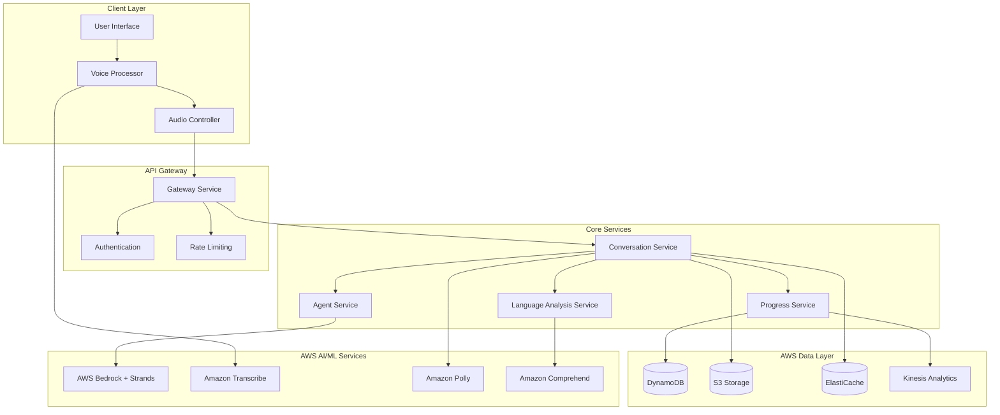

# Architecture Diagram

## Mermaid Diagram

## Visual Architecture

To generate a PNG version of this diagram:
1. Use Mermaid CLI: `mmdc -i docs/architecture-diagram.md -o docs/architecture-diagram.png`
2. Or use online tools like [Mermaid Live Editor](https://mermaid.live/)