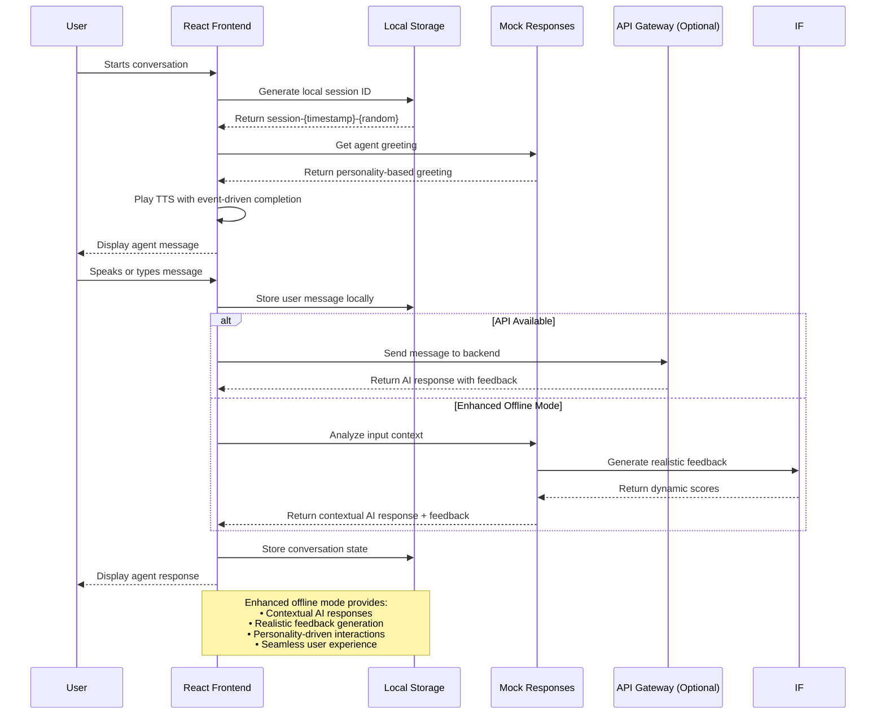
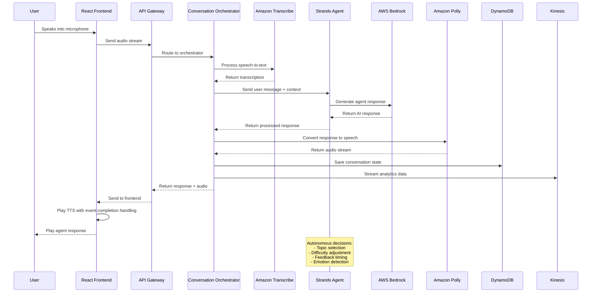
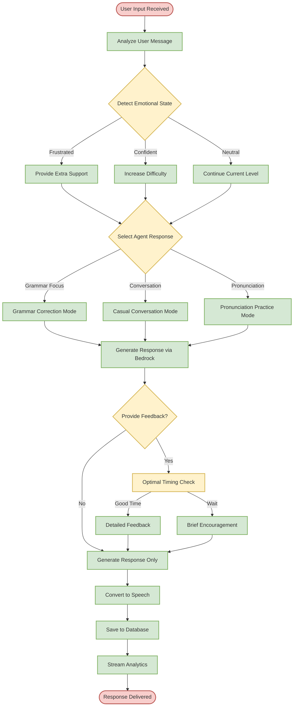
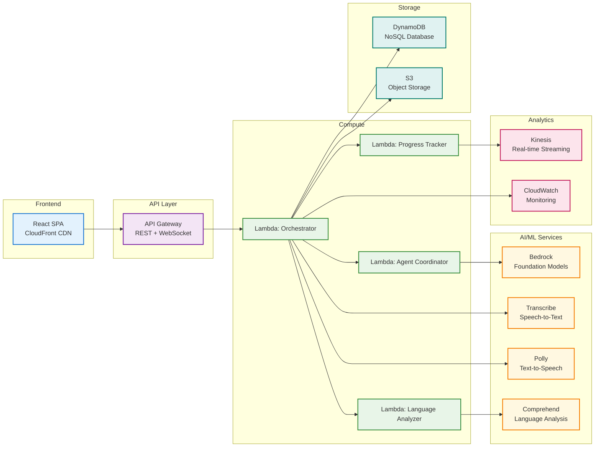
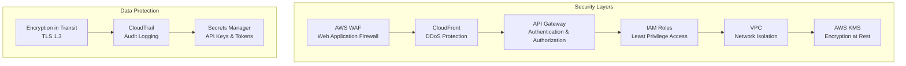
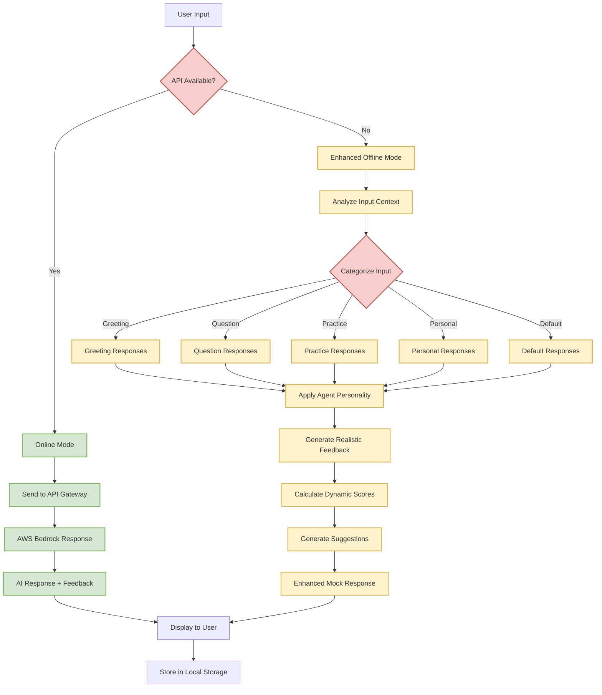

# LanguagePeer Architecture Diagram

## 🏗️ Complete System Architecture

```mermaid
graph TB
    subgraph "User Interface Layer"
        UI[React Frontend<br/>Enhanced Offline-First Interface]
        VR[Voice Recorder<br/>WebRTC Audio Capture]
        AP[Audio Player<br/>Playback & Visualization]
        AS[Agent Selector<br/>Personality Selection]
        FP[Feedback Panel<br/>Local Analytics]
        LS[Local Storage<br/>Session Management]
        MR[Enhanced Mock Responses<br/>Contextual AI Simulation]
        IF[Intelligent Feedback<br/>Offline Analysis Engine]
    end

    subgraph "API Gateway Layer"
        GW[AWS API Gateway<br/>RESTful Endpoints]
        AUTH[Authentication<br/>JWT & Session Management]
        CORS[CORS Configuration<br/>Cross-Origin Requests]
        RATE[Rate Limiting<br/>Request Throttling]
    end

    subgraph "Serverless Compute Layer"
        CO[Conversation Orchestrator<br/>AWS Lambda]
        AC[Agent Coordinator<br/>AWS Lambda]
        LA[Language Analyzer<br/>AWS Lambda]
        PA[Progress Analytics<br/>AWS Lambda]
        RE[Recommendation Engine<br/>AWS Lambda]
    end

    subgraph "AI/ML Services Layer"
        subgraph "AWS Bedrock Foundation Models"
            CLAUDE[Claude 3.5 Sonnet<br/>Primary Conversations]
            LLAMA[Llama 3.1 70B<br/>Alternative Responses]
            NOVA[Nova Pro<br/>Multimodal Capabilities]
        end
        
        subgraph "Voice Processing"
            TRANSCRIBE[Amazon Transcribe<br/>Speech-to-Text Streaming]
            POLLY[Amazon Polly<br/>Text-to-Speech Neural]
        end
        
        subgraph "Language Analysis"
            COMPREHEND[Amazon Comprehend<br/>NLP & Entity Detection]
            TRANSLATE[Amazon Translate<br/>Multi-language Support]
        end
    end

    subgraph "Strands Agent Framework"
        SA[Strands Orchestrator<br/>Agent Coordination]
        
        subgraph "Agent Personalities"
            FT[Emma<br/>Friendly Tutor]
            ST[Professor Chen<br/>Strict Teacher]
            CP[Alex<br/>Conversation Partner]
            PC[Coach Riley<br/>Pronunciation Coach]
        end
        
        subgraph "Agent Capabilities"
            AR[Autonomous Reasoning<br/>Decision Making]
            EM[Emotion Detection<br/>User State Analysis]
            DA[Difficulty Adjustment<br/>Adaptive Learning]
            FT_SYS[Feedback Timing<br/>Optimal Delivery]
        end
    end

    subgraph "Data Storage Layer"
        subgraph "Amazon DynamoDB"
            UP[User Profiles<br/>Learning History]
            CS[Conversation Sessions<br/>Message History]
            AS_STATE[Agent State<br/>Context & Memory]
            PM[Progress Metrics<br/>Performance Data]
        end
        
        subgraph "Amazon S3"
            AF[Audio Files<br/>Conversation Recordings]
            SA_ASSETS[Static Assets<br/>Frontend Resources]
            BU[Backups<br/>Data Archives]
        end
    end

    subgraph "Real-time Analytics Layer"
        subgraph "Amazon Kinesis"
            KS[Kinesis Streams<br/>Event Processing]
            KA[Kinesis Analytics<br/>Real-time Insights]
            KF[Kinesis Firehose<br/>Data Delivery]
        end
        
        CW[CloudWatch<br/>Monitoring & Logs]
        XR[X-Ray<br/>Distributed Tracing]
    end

    subgraph "Infrastructure Layer"
        CDK[AWS CDK<br/>Infrastructure as Code]
        CF[CloudFormation<br/>Stack Management]
        IAM[IAM Roles<br/>Security & Permissions]
        VPC[VPC<br/>Network Isolation]
    end

    %% User Flow Connections
    UI --> VR
    VR --> GW
    UI --> AS
    UI --> FP
    AP --> UI

    %% API Gateway Connections
    GW --> AUTH
    GW --> CORS
    GW --> RATE
    GW --> CO

    %% Lambda Function Connections
    CO --> AC
    CO --> LA
    CO --> PA
    CO --> RE

    %% AI Service Connections
    AC --> CLAUDE
    AC --> LLAMA
    AC --> NOVA
    CO --> TRANSCRIBE
    CO --> POLLY
    LA --> COMPREHEND
    RE --> TRANSLATE

    %% Strands Framework Connections
    AC --> SA
    SA --> FT
    SA --> ST
    SA --> CP
    SA --> PC
    SA --> AR
    SA --> EM
    SA --> DA
    SA --> FT_SYS

    %% Data Storage Connections
    CO --> UP
    CO --> CS
    AC --> AS_STATE
    PA --> PM
    CO --> AF
    UI --> SA_ASSETS

    %% Analytics Connections
    CO --> KS
    PA --> KA
    KS --> KF
    CO --> CW
    AC --> XR

    %% Infrastructure Connections
    CDK --> CF
    CF --> IAM
    CF --> VPC

    %% Styling
    classDef userLayer fill:#e1f5fe,stroke:#01579b,stroke-width:2px
    classDef apiLayer fill:#f3e5f5,stroke:#4a148c,stroke-width:2px
    classDef computeLayer fill:#e8f5e8,stroke:#1b5e20,stroke-width:2px
    classDef aiLayer fill:#fff3e0,stroke:#e65100,stroke-width:2px
    classDef strandsLayer fill:#fce4ec,stroke:#880e4f,stroke-width:2px
    classDef dataLayer fill:#e0f2f1,stroke:#004d40,stroke-width:2px
    classDef analyticsLayer fill:#f1f8e9,stroke:#33691e,stroke-width:2px
    classDef infraLayer fill:#fafafa,stroke:#424242,stroke-width:2px

    class UI,VR,AP,AS,FP userLayer
    class GW,AUTH,CORS,RATE apiLayer
    class CO,AC,LA,PA,RE computeLayer
    class CLAUDE,LLAMA,NOVA,TRANSCRIBE,POLLY,COMPREHEND,TRANSLATE aiLayer
    class SA,FT,ST,CP,PC,AR,EM,DA,FT_SYS strandsLayer
    class UP,CS,AS_STATE,PM,AF,SA_ASSETS,BU dataLayer
    class KS,KA,KF,CW,XR analyticsLayer
    class CDK,CF,IAM,VPC infraLayer
```

## 🔄 Offline-First Data Flow

## 🔄 Data Flow Architecture

## 🎯 Agent Decision Flow

## 🏗️ AWS Services Integration

## 📊 Performance Metrics

| Component | Target Performance | Monitoring |
|-----------|-------------------|------------|
| **Voice Processing** | < 2s transcription latency | CloudWatch Metrics |
| **Agent Response** | < 3s total response time | X-Ray Tracing |
| **Database Queries** | < 100ms average | DynamoDB Metrics |
| **API Gateway** | < 50ms routing | API Gateway Logs |
| **Frontend Loading** | < 2s initial load | CloudFront Analytics |

## 🔒 Security Architecture

## 🔄 Enhanced Offline Mode Architecture

### Offline Mode Features

- **Context Analysis**: Categorizes user input for appropriate response selection
- **Personality Preservation**: Each agent maintains distinct conversation styles
- **Realistic Feedback**: Dynamic scoring based on message complexity and length
- **Intelligent Suggestions**: Contextual recommendations for improvement
- **Seamless Experience**: Users cannot distinguish between online and offline modes

This architecture ensures:
- **Scalability**: Serverless components auto-scale based on demand
- **Reliability**: Multi-AZ deployment with automatic failover + enhanced offline fallbacks
- **Security**: End-to-end encryption and least-privilege access
- **Performance**: Edge caching and optimized data flows + instant offline responses
- **Cost Efficiency**: Pay-per-use pricing model + zero-cost offline functionality
- **Accessibility**: Full functionality regardless of network conditions