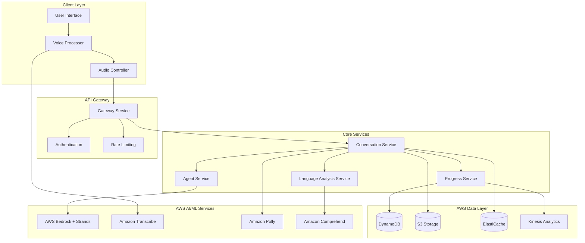

# LanguagePeer Design Document

## Overview

LanguagePeer is architected as a modular, voice-first application that combines real-time speech processing with intelligent AI agents to create natural language learning conversations. The system uses a microservices approach with distinct components for voice processing, AI agent management, conversation orchestration, and progress tracking.

The application prioritizes low-latency voice interactions while maintaining sophisticated language analysis capabilities. The modular AI agent system allows for diverse conversation partners with distinct personalities and teaching styles.

## Architecture

### AWS GenAI Hackathon Compliance

LanguagePeer meets all three mandatory hackathon requirements:

#### 1. Large Language Model (LLM) hosted on AWS Bedrock
- **Primary LLM**: AWS Bedrock foundation models (Claude 3.5 Sonnet, Llama 3.1, Nova Pro)
- **Model Selection**: Dynamic routing between models based on conversation context
- **Custom Fine-tuning**: Language-specific prompt engineering for optimal learning outcomes

#### 2. Required AWS Services Integration
- **Amazon Bedrock Agents**: Core agent orchestration and reasoning engine
- **Strands Agents SDK**: Modular agent personalities with autonomous decision-making
- **Amazon Bedrock**: Foundation model hosting and inference
- **Amazon Transcribe**: Real-time speech-to-text processing
- **Amazon Polly**: Natural speech synthesis for agent responses
- **Amazon Comprehend**: Language analysis and entity detection
- **AWS Lambda**: Serverless compute for agent logic
- **Amazon DynamoDB**: Conversation state and user progress storage
- **Amazon S3**: Audio file storage and retrieval
- **Amazon Kinesis**: Real-time analytics and event streaming

#### 3. AWS-Defined AI Agent Qualification
- **Reasoning LLMs**: Bedrock models make autonomous decisions about conversation flow, difficulty adjustment, and feedback generation
- **Autonomous Capabilities**: Agents independently select topics, adjust teaching methods, and provide personalized recommendations without human intervention
- **External Integrations**: 
  - Voice processing APIs (Transcribe/Polly)
  - Language analysis tools (Comprehend)
  - Real-time databases (DynamoDB)
  - Analytics systems (Kinesis)
  - Multi-agent coordination through Strands framework

### Architecture Focus

LanguagePeer leverages AWS's comprehensive AI/ML services to create a serverless, scalable language learning platform. The architecture emphasizes:

- **Autonomous AI Agents**: Strands-powered agents with independent reasoning and decision-making
- **Serverless Architecture**: Lambda functions with API Gateway for cost-effective scaling
- **Real-time Voice Processing**: Transcribe and Polly for seamless voice interactions
- **Intelligent Analytics**: Comprehend and Kinesis for language analysis and progress tracking
- **Managed Infrastructure**: DynamoDB, S3, and ElastiCache for reliable data management

### High-Level Architecture




### Technology Stack

- **Frontend**: React/React Native for cross-platform support
- **Backend**: AWS Lambda with API Gateway for serverless architecture
- **Voice Processing**: Amazon Transcribe (STT) and Amazon Polly (TTS)
- **AI/ML**: AWS Bedrock with Strands Agents for modular AI conversations
- **Database**: Amazon DynamoDB for NoSQL data, Amazon ElastiCache for session state
- **Real-time Communication**: AWS AppSync for real-time subscriptions
- **Storage**: Amazon S3 for audio file storage
- **Analytics**: Amazon Kinesis for real-time data streaming
- **Deployment**: AWS CDK/CloudFormation for infrastructure as code

## Components and Interfaces

### AWS Voice Processing Component

**Responsibilities:**
- Real-time speech-to-text using Amazon Transcribe Streaming
- Audio storage and processing via S3 and Lambda
- Voice synthesis using Amazon Polly with SSML
- Audio quality assessment using Transcribe confidence metrics

**Key Interfaces:**
```typescript
interface AWSVoiceProcessor {
  startTranscribeStream(): Promise<TranscribeStreamingClient>
  stopTranscription(): Promise<TranscriptionResult>
  synthesizeWithPolly(text: string, voice: PollyVoiceId): Promise<S3AudioUrl>
  uploadAudioToS3(audioBlob: Blob): Promise<string>
  getTranscribeConfidence(): TranscribeQualityMetrics
}

interface AudioQualityMetrics {
  clarity: number
  volume: number
  backgroundNoise: number
  recommendations: string[]
}
```

### AWS Bedrock Strands Agent Service

**Responsibilities:**
- Orchestrate multiple Strands agents with distinct personalities
- Leverage AWS Bedrock foundation models for natural conversations
- Maintain conversation state using DynamoDB and ElastiCache
- Adapt agent behavior based on user progress and preferences

**Key Interfaces:**
```typescript
interface StrandsAgent {
  id: string
  bedrockModelId: string
  personality: AgentPersonality
  generateResponse(context: ConversationContext): Promise<AgentResponse>
  analyzeUserInput(input: UserInput): Promise<LanguageAnalysis>
  adaptToUserLevel(userProfile: UserProfile): void
}

interface AgentPersonality {
  name: string
  systemPrompt: string
  traits: string[]
  conversationStyle: ConversationStyle
  specialties: string[]
  bedrockParameters: BedrockInferenceParams
}

interface ConversationContext {
  sessionId: string
  conversationHistory: Message[]
  userProfile: UserProfile
  currentTopic: string
  sessionGoals: string[]
  bedrockSessionState: BedrockSessionState
}
```

For complete technical specifications, see the full design document in the repository.